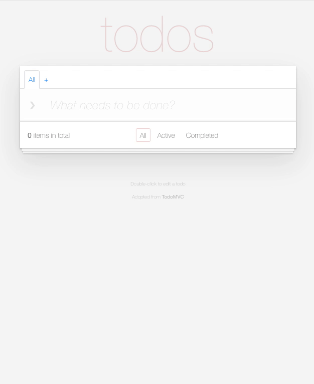

# React TodoMVC Example

> React is a JavaScript library for creating user interfaces. Its core principles are declarative code, efficiency, and flexibility. Simply specify what your component looks like and React will keep it up-to-date when the underlying data changes.

> _[React - facebook.github.io/react](http://facebook.github.io/react)_

## Learning React

The [React getting started documentation](http://facebook.github.io/react/docs/getting-started.html) is a great way to get started.

Here are some links you may find helpful:

* [Documentation](http://facebook.github.io/react/docs/getting-started.html)
* [API Reference](http://facebook.github.io/react/docs/reference.html)

## Dependencies

These dependencies are not included as part of the package install and should be setup beforehand.

* [Node.js](https://nodejs.org/en/)
* [Yarn Package Manager](https://yarnpkg.com/)

## Running

To install the required pacakges:
```
yarn install
```

To build and start the local server:
```
yarn start
```

## Task

* Add the ability to create separate lists of todo items.  
* The lists can be renamed and removed along with their todos.  
* The lists are to be organized as tabs above the todo component.
  
Estimated completion time: 2-3 hours.

### Constraints

* Do not bring in any new frameworks or packages
  
Example:  


### Submission

Create a merge request featuring your set of changes.
